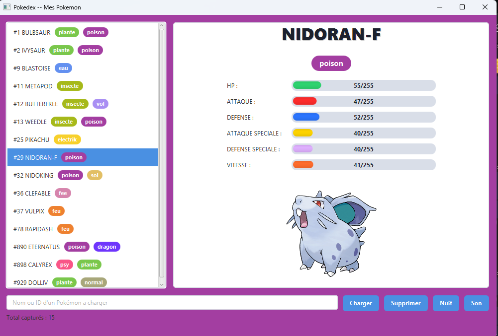
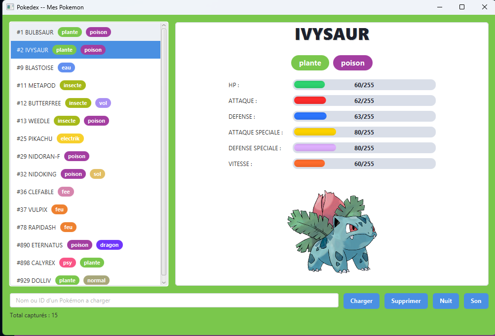

# Pokédex en Java

### Étudiants : Jean-François Pierre et Charles Legault-Boutin

## Présentation

Dans le projet PokéHack, nous avons créé une application en Java qui permet d'afficher et de gérer un Pokédex avec une interface graphique en JavaFx. L'application appelle une API appelée Pokeapi et intègre les données des Pokemon dans une base de données PostgreSQL grâce à JDBC. Ce projet nous a permis d'expérimenter le modèle MVC en divisant le modèle, la vue et le contolleur dans des paquets différents.

## Comment activer l'application

#### Allez sur IntelliJ IDEA et entrez la commande suivante dans le terminal :

git clone https://github.com/jfl24/pokedev-java.git

#### Sur pgAdmin, créez une nouvelle base de données, et dans le QueryTool, entrez les donnnées du fichier sql/schema.sql (ou du fichier pokedex.sql situé dans le dossier de remise).

#### Compilez la fonction Main.main(); du projet.

## Objectifs du projet :

- Maîtriser l'appel d'une API pour obtenir des données et les traiter avec Java
- Maîtriser l'utilsation de JDBC pour manipuler une base de données PostgreSQL
- Approfondir l'apprentissage des classes et des fonctions dans Java
- Uiliser l'outil JavaFX pour créer une interface graphique qui affiche nos données
- Harmoniser le tout avec un controlleur qui fait le lien entre la base de données et l'interface graphique

## Outils requis pour le projet :

- Java 17+
- JavaFX 21
- PostgreSQL 15+
- Maven
- Jackson
- PokéAPI
- Git et GitHub
- IntelliJ IDEA

## Fonctionnalités de l'application :

- Affichage de la liste des Pokémon inclus dans le Pokédex
- Changement de la couleur de l'interface graphique selon le type principal du Pokémon sélectionné
- Affichage d'une image et des informations du Pokémon sélectionné dans une carte
- Affichage de barres graphiques qui montrent les statistiques du Pokémon choisi
- Champ de recherche pour ajouter un nouveau Pokémon dans le Pokédex
- Bouton pour supprimer du Pokédex un Pokémon
- Bouton pour entendre le cri du Pokémon sélectionné
- Affichage du nombre de Pokémon inclus présentement dans la liste
- Bouton pour alterner entre les modes Nuit et Jour de l'interface graphique

## Liste des Bonus implémentés :

- L'affichage du nombre de Pokémon dans la base de données
- Le bouton pour entendre le cri d'un Pokémon
- Alternance entre "Light Mode" et "Dark Mode" selon le choix de l'utilisateur
